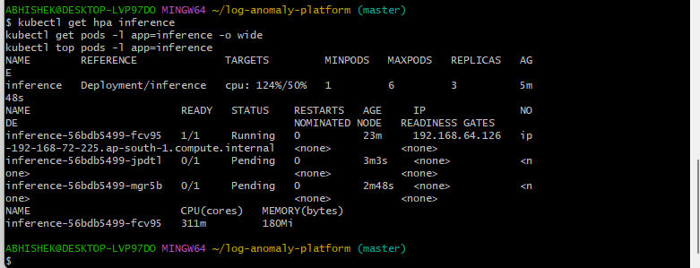
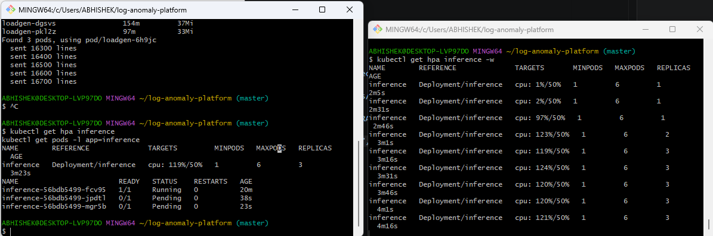
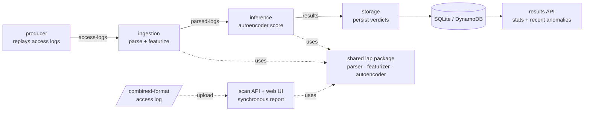

# Real-Time Log Anomaly Detection Platform

A streaming platform that ingests web-server access logs, scores each request for
anomalies with an unsupervised autoencoder, and surfaces flagged requests — with
an explanation of *why* each was flagged — through both a live pipeline and an
upload-based scanner. Runs locally on Docker Compose and on AWS as an autoscaling
Kubernetes (EKS) deployment.

> **Honest framing.** Built with production-grade infrastructure and engineering
> practices (streaming backbone, decoupled microservices, containerization,
> Kubernetes with horizontal autoscaling, IRSA-based cloud auth, tests). It is a
> portfolio/engineering project demonstrating production patterns — not a deployed
> commercial system. Current evaluation uses synthetic and user-supplied data;
> results on synthetic data are not a substitute for real-world benchmarking.

---

## Highlight: autoscaling demonstrated under load (EKS)

The inference service runs on Amazon EKS behind a Horizontal Pod Autoscaler. Under
a load test that floods the pipeline, inference CPU crosses the 50% target and
Kubernetes scales the deployment out automatically:



The HPA watch (right) shows the progression in real time: `cpu 1% → 2% → 97% →
123%/50%` with `REPLICAS 1 → 2 → 3` while the load generator streams records (left).



Honest detail worth stating: scaling settled at **3 running replicas**, not the
configured max of 6, because the two `t3.small` worker nodes ran out of schedulable
CPU — the additional pods sat `Pending`. This is the real interaction between *pod*
autoscaling (HPA) and *node* capacity; the documented next layer is the **Cluster
Autoscaler**, which would add nodes so pending pods can schedule.

---

## Architecture



Apache Kafka (KRaft mode) is the streaming backbone; topic names sit on the arrows.
Every service reads configuration from environment variables and shares a single
`lap` package, so the same parse → featurize → score representation is used end to
end — no train/serve feature drift. The same container image runs every service
role, locally via Compose and on EKS as separate Deployments.

---

## How it works

**Detection.** A small dense autoencoder is trained only on *normal* traffic. At
inference, reconstruction error is the anomaly score: a request that resembles
nothing the model learned as normal reconstructs poorly and scores high. The
threshold is set from the 99th percentile of the normal-traffic error distribution.
Labels (where available) are used for evaluation only — the model itself is
unsupervised, mirroring how real security tooling detects unknown threats.

**Features.** Each request is reduced to 20 interpretable structural signals
(query length, special-character density, entropy, suspicious-token counts,
method/status one-hots, tool-like user agents, …). These are cheap, effective at
separating normal browsing from web attacks, and — crucially — explainable: every
flagged request names the features that drove the score.

**Two entry points.** A live streaming pipeline (producer → … → storage → API) and
a synchronous scanner (upload a log, get a report) — both backed by the same model.

---

## Tech stack

| Layer         | Choice                                                        |
|---------------|---------------------------------------------------------------|
| Language      | Python 3.12                                                   |
| ML            | PyTorch (dense autoencoder, CPU-only build)                   |
| Streaming     | Apache Kafka 3.9 (KRaft mode, no ZooKeeper)                   |
| Services      | FastAPI + Kafka consumers/producers                           |
| Local storage | SQLite (stand-in for the cloud store)                         |
| Cloud         | AWS — EKS, ECR, S3, DynamoDB, Kinesis, CloudWatch             |
| Orchestration | Kubernetes (EKS), Horizontal Pod Autoscaler, IRSA            |
| Packaging     | Docker (single ~1.5 GB image, run in multiple roles)          |
| IaC / tooling | eksctl, kubectl, AWS CLI, Helm                                |
| Tests         | pytest                                                        |

---

## Quick start (local)

### Option A — scan a log (no Kafka required)

```bash
python -m venv .venv && source .venv/Scripts/activate   # Windows Git Bash
pip install -e .
python scripts/gen_logs.py             # generate the training corpus (seeded, reproducible)
python ml/training/train.py            # trains the model -> ml/models/detector.pt
uvicorn services.api.main:app --port 9000
# open http://localhost:9000 and click "load a sample log"
```

### Option B — full streaming pipeline (Docker)

```bash
python scripts/gen_logs.py                            # generate sample data first
docker build -t lap-services:local .

cd infra
docker compose up -d                                  # Kafka + UI
# create topics (first run only):
docker exec lap-kafka /opt/kafka/bin/kafka-topics.sh --bootstrap-server localhost:9092 \
  --create --topic access-logs --partitions 1 --replication-factor 1
docker exec lap-kafka /opt/kafka/bin/kafka-topics.sh --bootstrap-server localhost:9092 \
  --create --topic parsed-logs --partitions 1 --replication-factor 1
docker exec lap-kafka /opt/kafka/bin/kafka-topics.sh --bootstrap-server localhost:9092 \
  --create --topic results --partitions 1 --replication-factor 1

docker compose -f docker-compose.services.yml up -d   # the five services
cd ..

curl -s http://localhost:9100/stats                   # totals + anomaly rate
curl -s "http://localhost:9100/anomalies?limit=5"     # recent flagged requests
```

Kafka UI: http://localhost:18080 · Results API: http://localhost:9100

Tear down: `docker compose -f docker-compose.services.yml down && docker compose down`
(from `infra/`).

---

## Cloud deployment (AWS / EKS)

The pipeline runs on Amazon EKS with the same container image, autoscaling the
inference service under load. Manifests live in `infra/k8s/`. High level:

```bash
# 1. cluster (managed node group, 2x t3.small, OIDC for IRSA)
eksctl create cluster --name lap-eks --region ap-south-1 --version 1.31 \
  --nodegroup-name lap-nodes --node-type t3.small --nodes 2 --nodes-min 2 \
  --nodes-max 4 --managed --with-oidc

# 2. IRSA service account: pods get S3 + DynamoDB access with no baked-in keys
eksctl create iamserviceaccount --cluster lap-eks --region ap-south-1 \
  --namespace lap --name lap-sa \
  --attach-policy-arn arn:aws:iam::aws:policy/AmazonS3ReadOnlyAccess \
  --attach-policy-arn arn:aws:iam::aws:policy/AmazonDynamoDBFullAccess --approve

# 3. deploy pipeline + HPA
kubectl apply -f infra/k8s/kafka.yaml
kubectl apply -f infra/k8s/services.yaml
kubectl apply -f infra/k8s/hpa.yaml

# 4. drive load and watch it scale
kubectl apply -f infra/k8s/load-job.yaml
kubectl get hpa inference -w

# 5. tear everything down (control plane bills hourly — never leave it running)
eksctl delete cluster --name lap-eks --region ap-south-1
```

**Cost discipline.** The EKS control plane bills ~$73/mo *while it exists*. Every
session followed create → use → **delete → verify-zero** (checking for orphaned
NAT gateways, instances, and CloudFormation stacks). Cloud managed services were
each validated then torn down; only the S3 artifact bucket (pennies/month) is kept.

**Cloud auth (IRSA).** Pods assume an IAM role via a Kubernetes service account —
no long-lived credentials in the image. The model is stored in S3 and verdicts
persist to DynamoDB (the cloud counterpart to the local SQLite layer).

---

## Project structure

```
lap/                 shared package: parser, features, model, detector, model_store
ml/training/         train.py, eval.py
ml/models/           detector.pt (gitignored — regenerate with train.py)
services/
  producer/          replays access logs into Kafka
  ingestion/         parse + featurize  (access-logs -> parsed-logs)
  inference/         autoencoder scoring (parsed-logs -> results)
  results/           storage consumer + read API + SQLite/DynamoDB layers
  api/               upload-based scan API + web UI
scripts/             gen_logs.py (seeded synthetic data), kinesis_produce.py
infra/
  docker-compose*.yml    local Kafka + services
  k8s/                   EKS manifests (kafka, services, hpa, load-job)
  *.json                 ECS task def + IAM trust policy (Fargate validation)
tests/               pytest suite (unit, integration, end-to-end)
Dockerfile           single image, run in multiple roles
screenshots/         HPA autoscaling evidence
```

---

## Testing

```bash
pytest -q
```

Covers the parser, featurizer, scoring path, storage layer, the scan API, and an
end-to-end integration test (raw line → parse → featurize → score → store → query).
Data and model artifacts are gitignored and reproducible: `scripts/gen_logs.py`
(fixed seed) regenerates the corpus; `ml/training/train.py` regenerates the model.

---

## Status & roadmap

- [x] **Phase 1 — local pipeline.** Detection model, scanner UI, Kafka backbone,
  four decoupled streaming services, persistence, read API, full containerization;
  runs end to end on one `docker compose up`. **Complete and demonstrated.**
- [x] **Phase 2 — AWS managed services.** ECR (image pushed), Kinesis (streaming
  round-trip), S3 (model artifact store), DynamoDB (verdict store), ECS Fargate
  (container runs on cloud compute, pulls model from S3). Each validated and torn
  down; image slimmed 8.07 GB → 1.49 GB (CPU-only torch) for fast pulls.
- [x] **Phase 3 — EKS + autoscaling.** Pipeline deployed as pods on EKS with IRSA;
  **HPA autoscaling demonstrated and captured under load** (inference 1→3 replicas,
  node-capacity bound). *Remaining (optional): Prometheus/Grafana dashboards.*
- [ ] **Phase 4 — harden, document, demo.** CI/CD, security pass, live users,
  demo video.

---

## Limitations (read before trusting the numbers)

- Evaluation data is **synthetic** (a seeded generator) plus user uploads. Strong
  scores on data designed to be separable are not evidence of real-world accuracy;
  benchmarking against real labeled traffic (e.g. CSIC) is future work.
- The model is deliberately simple — the engineering, not the model, is the focus.
- The EKS demo uses a single-broker in-cluster Kafka and small nodes; it proves the
  autoscaling and orchestration patterns, not production-scale throughput.
- Autoscaling was node-capacity bound at 3 replicas; Cluster Autoscaler is the
  documented next step for scaling beyond node limits.
