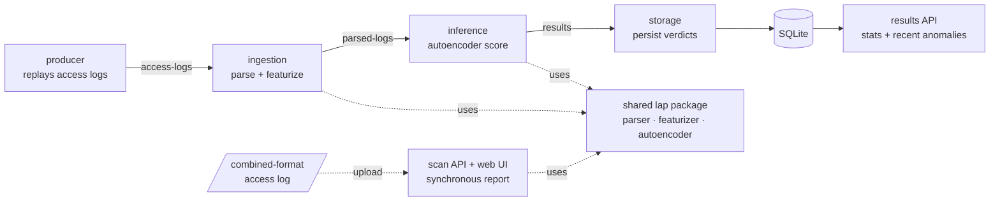

# Real-Time Log Anomaly Detection Platform

A streaming platform that ingests web-server access logs, scores each request for
anomalies with an unsupervised autoencoder, and surfaces flagged requests — with
an explanation of *why* each was flagged — through both a live pipeline and an
upload-based scanner.

> **Honest framing.** Built with production-grade infrastructure and engineering
> practices (streaming backbone, decoupled microservices, containerization, tests).
> It is a portfolio/engineering project demonstrating production patterns — not a
> deployed commercial system. Current evaluation uses synthetic and user-supplied
> data; results on synthetic data are not a substitute for real-world benchmarking.

---

## Architecture



Apache Kafka (KRaft mode) is the streaming backbone; topic names sit on the arrows.
Every service reads configuration from environment variables and shares a single
`lap` package, so the same parse → featurize → score representation is used end to
end — no train/serve feature drift.

---

## How it works

**Detection.** A small dense autoencoder is trained only on *normal* traffic. At
inference, reconstruction error is the anomaly score: a request that resembles
nothing the model learned as normal reconstructs poorly and scores high. The
threshold is set from the 99th percentile of the normal-traffic error distribution.
Labels (where available) are used for evaluation only — the model itself is
unsupervised, mirroring how real security tooling detects unknown threats.

**Features.** Each request is reduced to 20 interpretable structural signals
(query length, special-character density, entropy, suspicious-token counts,
method/status one-hots, tool-like user agents, …). These are cheap, effective at
separating normal browsing from web attacks, and — crucially — explainable: every
flagged request names the features that drove the score.

**Two entry points.** A live streaming pipeline (producer → … → storage → API) and
a synchronous scanner (upload a log, get a report) — both backed by the same model.

---

## Tech stack

| Layer        | Choice                                             |
|--------------|----------------------------------------------------|
| Language     | Python 3.12                                        |
| ML           | PyTorch (dense autoencoder)                        |
| Streaming    | Apache Kafka 3.9 (KRaft mode, no ZooKeeper)        |
| Services     | FastAPI + Kafka consumers/producers                |
| Storage      | SQLite (local stand-in for DynamoDB/RDS)           |
| Packaging    | Docker, Docker Compose (single image, six roles)   |
| Tests        | pytest                                             |

---

## Quick start

### Option A — scan a log (no Kafka required)

```bash
python -m venv .venv && source .venv/Scripts/activate   # Windows Git Bash
pip install -e .
python ml/training/train.py            # trains the model -> ml/models/detector.pt
uvicorn services.api.main:app --port 9000
# open http://localhost:9000 and click "load a sample log"
```

### Option B — full streaming pipeline (Docker)

```bash
docker build -t lap-services:local .

cd infra
docker compose up -d                                  # Kafka + UI
# create topics (first run only):
docker exec lap-kafka /opt/kafka/bin/kafka-topics.sh --bootstrap-server localhost:9092 \
  --create --topic access-logs --partitions 1 --replication-factor 1
docker exec lap-kafka /opt/kafka/bin/kafka-topics.sh --bootstrap-server localhost:9092 \
  --create --topic parsed-logs --partitions 1 --replication-factor 1
docker exec lap-kafka /opt/kafka/bin/kafka-topics.sh --bootstrap-server localhost:9092 \
  --create --topic results --partitions 1 --replication-factor 1

docker compose -f docker-compose.services.yml up -d   # the five services
cd ..

curl -s http://localhost:9100/stats                   # totals + anomaly rate
curl -s "http://localhost:9100/anomalies?limit=5"     # recent flagged requests
```

Kafka UI: http://localhost:18080 · Results API: http://localhost:9100

Tear down: `docker compose -f docker-compose.services.yml down && docker compose down`
(from `infra/`).

---

## Project structure

```
lap/                 shared package: parser, features, model, detector
ml/training/         train.py, eval.py
ml/models/           detector.pt (gitignored — regenerate with train.py)
services/
  producer/          replays access logs into Kafka
  ingestion/         parse + featurize  (access-logs -> parsed-logs)
  inference/         autoencoder scoring (parsed-logs -> results)
  results/           storage consumer + read API + SQLite layer
  api/               upload-based scan API + web UI
scripts/gen_logs.py  reproducible synthetic data generator (seeded)
infra/               docker-compose for Kafka and for the services
tests/               pytest suite
Dockerfile           single image, run six ways via compose
```

---

## Testing

```bash
pytest -q
```

Covers the parser, featurizer, scoring path, storage layer, and the scan API.
Data and model artifacts are gitignored and reproducible: `scripts/gen_logs.py`
(fixed seed) regenerates the corpus; `ml/training/train.py` regenerates the model.

---

## Status & roadmap

- [x] **Phase 1 — local pipeline.** Detection model, scanner UI, Kafka backbone,
  four decoupled streaming services, persistence, read API, full containerization;
  runs end to end on one `docker compose up`. **Complete and demonstrated.**
- [ ] **Phase 2 — AWS managed services.** ECR, Kinesis, S3, DynamoDB, ECS.
- [ ] **Phase 3 — EKS + autoscaling.** Kubernetes deployment, Horizontal Pod
  Autoscaler demonstrated under load, Prometheus/Grafana, alerting.
- [ ] **Phase 4 — harden, document, demo.** CI/CD, security pass, live users,
  demo video.

Cloud phases are in progress; this repository currently runs as a containerized
local platform.

---

## Limitations (read before trusting the numbers)

- Evaluation data is **synthetic** (a seeded generator) plus user uploads. Strong
  scores on data designed to be separable are not evidence of real-world accuracy;
  benchmarking against real labeled traffic (e.g. CSIC) is future work.
- The model is deliberately simple — the engineering, not the model, is the focus.
- Single-partition topics and a single broker locally; cloud phases address scale.